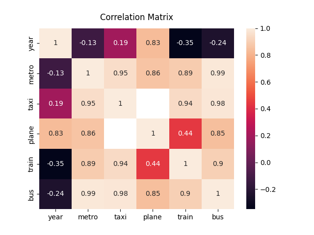

## Gráfica 2 - Correlation matrices

#### Fuentes de datos:

1. [AENA: Estadísticas de tráfico aéreo](https://www.aena.es/es/estadisticas/inicio.html) ([datos en CSV](../data/plane-usage.csv))
1. [INE: Transporte urbano: metro y autobus en ciudades que dispongan de metro](https://ine.es/jaxiT3/Tabla.htm?t=20193) ([datos en CSV](../data/metro-usage.csv))
1. [INE: Transporte urbano por autobús por CCAA](https://ine.es/jaxiT3/Tabla.htm?t=20240) ([datos en CSV](../data/transporte-urbano-por-autobus.csv))
1. [INE: Viajeros transportados en transporte ferroviario](https://ine.es/jaxiT3/Tabla.htm?t=24355) ([datos en CSV](../data/transporte-ferroviario.csv))
1. [INE: Uso del taxi (hasta 2019)](https://ine.es/jaxi/Tabla.htm?tpx=32954&L=0) ([datos en CSV](../data/transporte-por-taxi.csv))

#### Resultado:

#### Datos intermedios:

| Año  | Metro   | Taxi  | Avión     | Tren      | Bus     |
|------|---------|-------|-----------|-----------|---------|
| 1994 |         | 69547 |           |           |         |
| 1995 |         | 69832 |           |           |         |
| 1996 |         | 70068 |           |           |         |
| 1997 |         | 70084 |           |           |         |
| 1998 |         | 70363 |           |           |         |
| 1999 |         | 70541 |           |           |         |
| 2000 |         | 7067  |           |           |         |
| 2001 |         | 70713 |           |           |         |
| 2002 |         | 70418 |           |           |         |
| 2003 |         | 70646 |           |           |         |
| 2004 |         | 70597 |           |           |         |
| 2005 |         | 70332 |           |           |         |
| 2006 |         | 70276 |           |           |         |
| 2007 |         | 69862 |           |           |         |
| 2008 |         | 69884 |           |           |         |
| 2009 |         | 69712 |           |           |         |
| 2010 |         | 69566 |           | 552930296 |         |
| 2011 |         | 69681 |           | 565943209 |         |
| 2012 | 1140584 | 69889 |           | 555354874 | 1647443 |
| 2013 | 1089448 | 69769 |           | 558625362 | 1625648 |
| 2014 | 1099364 | 69935 |           | 559332920 | 1629652 |
| 2015 | 1123530 | 70373 |           | 561972781 | 1649390 |
| 2016 | 1137234 | 70561 |           | 569741958 | 1706536 |
| 2017 | 1191361 | 71081 |           | 593354431 | 1742019 |
| 2018 | 1246091 | 71265 |           | 619055425 | 1767912 |
| 2019 | 1275644 | 72072 |           | 627107615 | 1826366 |
| 2020 | 672741  |       |           | 329477314 | 1009750 |
| 2021 | 846026  |       | 119952578 | 404391555 | 1235708 |
| 2022 | 1111254 |       | 243693689 | 541593977 | 1527874 |
| 2023 | 1321149 |       | 283201865 | 653741348 | 1870080 |
| 2024 | 1040135 |       | 266067541 | 343143418 | 1489851 |

